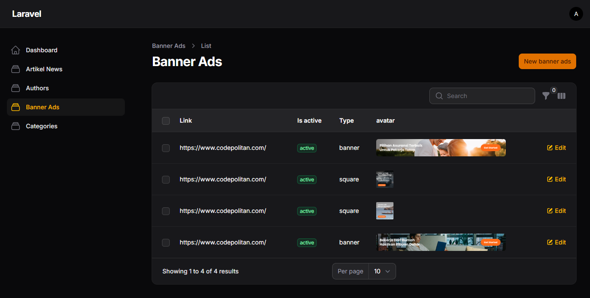

# 📰 News Website with Laravel & Filament Admin

Project ini adalah sebuah **website portal berita** yang dibangun menggunakan **Laravel** sebagai backend dan **Filament** sebagai admin panel. Website ini memungkinkan pengguna untuk membaca berita terbaru dari berbagai kategori, menemukan berita berdasarkan kategori, melakukan pencarian, serta melihat profil penulis berita.

---

## 📌 About
Website ini dirancang untuk digunakan oleh banyak orang dalam mengakses berita terbaru secara cepat dan mudah.  
Admin dapat mengelola konten berita melalui **Filament Admin Panel** dengan fitur CRUD untuk kategori, berita, penulis, serta banner iklan.

---

## 🚀 Main Features
- 🔑 **Sign in Admin** (Filament Authentication)
- 📂 **CRUD Categories**  
- 📰 **CRUD News**  
- ✍️ **CRUD Author**  
- 📢 **Banner Ads** (aktif/nonaktif)  
- ⭐ **Featured News** (berita unggulan)  
- 🔎 **Search News** (berdasarkan judul, kategori, atau penulis)  
- ⚡ **SEO-Friendly Optimization**

---

## 🗂️ Entity Relationship Diagram (ERD)

.png)

**Tabel Utama:**
- **Users**: autentikasi admin  
- **Categories**: kategori berita  
- **Authors**: data penulis berita  
- **Artikel News**: konten berita (relasi ke kategori & author)  
- **Banner Ads**: iklan/banner promosi  

Relasi utama:
- Satu **Category** memiliki banyak **News**  
- Satu **Author** memiliki banyak **News**

---

## UI Website
**Halaman Index**


**Halaman Kategori**


**Halaman News Detail**


## UI Admin Dashboard

**Halaman Artikel**


**Halaman Editor Artikel**


**Halaman Admin Category**


**Halaman CRUD Banner**


**Halaman CRUD Author**


## ⚙️ Tech Stack
- [Laravel 10+](https://laravel.com/) - PHP Framework
- [Filament](https://filamentphp.com/) - Admin Panel
- MySQL - Database
- Tailwind CSS - Styling
- Blade Template Engine

---


## 🛠️ Installation
1. Clone repository
   ```bash
   git clone https://github.com/username/news-website.git
   cd news-website

2. Install dependencies
   ```bash
   composer install
   npm install && npm run dev

3. Copy .env file & konfigurasi database
   ```bash
   cp .env.example .env
   php artisan key:generate

4. Migrasi & seeding database
   ```bash
   php artisan migrate --seed

5. Jalankan server
   ```bash
   php artisan serve

6. Akses website di http://localhost:8000

🔐 Admin Panel

Filament Admin Panel dapat diakses di:
```bash
http://localhost:8000/admin
```

## Default Admin Account:
- Email: admin@mail.com
- Password: admin123
